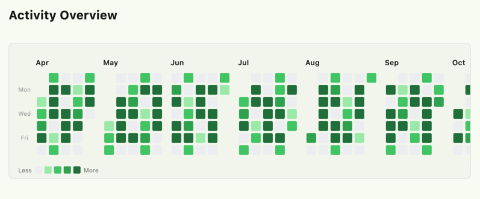

# Animated Habit Heatmap

A beautiful, customizable animated heatmap widget for visualizing habit tracking data in Flutter. Display your activity with smooth color animations, perfectly mimicking the GitHub contribution graph layout with month-grouped horizontal scrolling.



## Features

✨ **Core Features**
- 📅 **GitHub-Style Layout**: Days are grouped into months, arranged in columns (weeks), with horizontal scrolling.
- 🎨 **Smooth Animations**: High-performance color transitions when data changes.
- 📱 **Responsive & Scrollable**: Designed to handle 365+ days of data with smooth horizontal navigation.
- 🎯 **Interactive Cells**: Built-in support for tap callbacks and native tooltips.
- 📊 **Professional Legend**: Optional "Less -> More" intensity legend.
- 🔥 **Built-in Analytics**: Utility methods for streak calculation and activity tracking.
- ⚡ **Lightweight**: Zero external dependencies.

🎛️ **Customization**
- Use `HeatmapStyle` for fine-grained control over cell size, spacing, border radius, and typography.
- Comes with predefined color schemes (GitHub, Blue, Red, Purple, etc.) via `HeatmapColorScheme`.

## Getting Started

### Installation

Add this to your `pubspec.yaml`:

```yaml
dependencies:
  animated_habit_heatmap: ^0.1.0
```

### Basic Usage

```dart
import 'package:animated_habit_heatmap/animated_habit_heatmap.dart';

// Your data: Map<DateTime, int>
final habitData = {
  DateTime(2024, 1, 1): 5,
  DateTime(2024, 1, 2): 3,
};

AnimatedHabitHeatmap(
  data: habitData,
  colorScale: HeatmapColorScheme.github,
  onCellTap: (date, count) {
    print("Clicked on $date with count $count");
  },
)
```

### Advanced Customization

```dart
AnimatedHabitHeatmap(
  data: habitData,
  monthCount: 12,
  showLegend: true,
  style: HeatmapStyle(
    cellSize: 18.0,
    spacing: 2.0,
    borderRadius: 4.0,
    monthTextStyle: TextStyle(fontWeight: FontWeight.bold),
  ),
  colorScale: HeatmapColorScheme.purple,
)
```

## Contributing

Contributions are welcome! Please feel free to submit a Pull Request.

## License

This project is licensed under the MIT License - see the [LICENSE](LICENSE) file for details.
